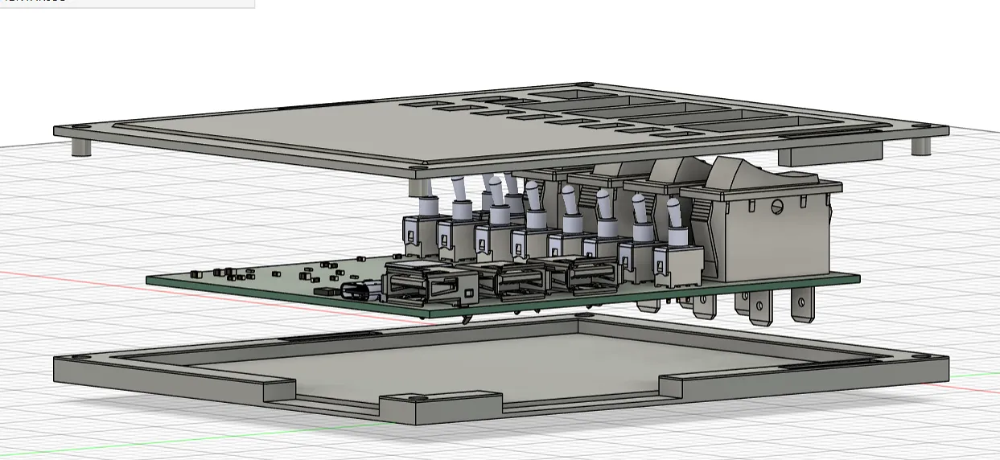
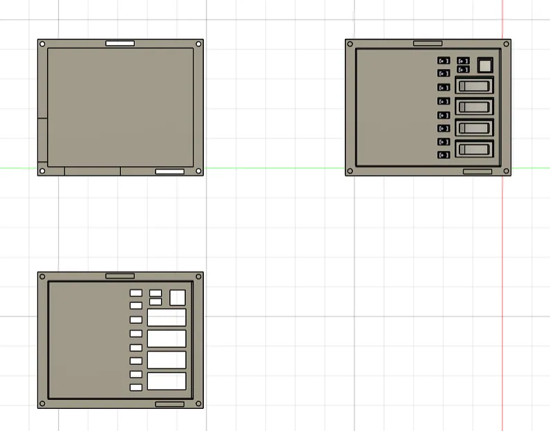
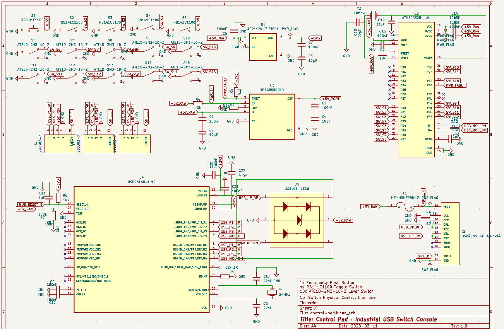
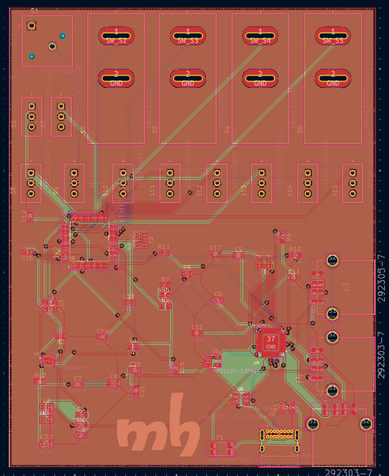
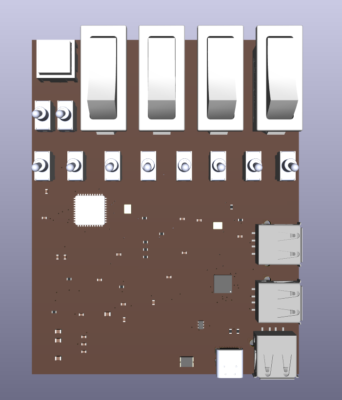
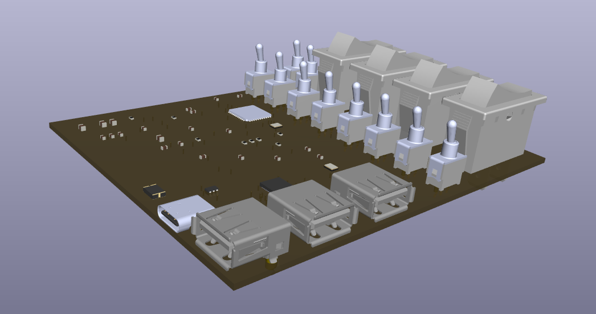

# Control Pad – Industrial USB Switch Console

A multi-input industrial-style USB control console featuring 15 physical switches, dual USB-C and triple USB-A inputs.
Designed to convert real electrical states into digital USB logic signals, inspired by cockpit and control room panels.

The Control Pad combines mechanical robustness with clean PCB design, delivering a physical command interface for software control, automation, streaming, simulation, and experimental hardware interaction.

---

## 3D Assembly

---

## Schematic

---

## PCB

---

## 3D PCB

---

## Case Fit

---

# Overview

The Control Pad is a 15-switch physical interface composed of:

* 1x Emergency Push Button (Primary Action Trigger)
* 4x RB141C1100 Toggle Switches
* 10x ATE1D-2M3-10-Z Lever Switches
* 2x USB-C Inputs
* 3x USB-A Inputs

The system detects electrical state transitions and converts them into USB logic signals for computer interaction.

Designed with:

* KiCad 9
* 4-layer PCB stackup
* Industrial-style layout
* 3D printed enclosure

---

# Features

* 15 physical control inputs
* Dedicated emergency trigger button
* Multi-USB input architecture
* Electrical-to-digital state conversion
* 4-layer PCB for signal integrity
* Custom 3D case design
* Fully open hardware

---

# Technical Specifications

* PCB: 4 Layers
* Surface Finish: (HASL / ENIG – update accordingly)
* Power via USB
* Digital signal processing via MCU firmware
* Designed for stable mechanical mounting

---

# Firmware

Firmware implemented in `firmware/` (C++, PlatformIO, ATmega32U4):

* HID Gamepad output for 15 inputs
* Debounced input scanning
* Mapping:
  * `EMERGENCY = 0`
  * `RB1..RB4 = 1..4`
  * `TOGGLE1..TOGGLE10 = 5..14`

## `studio/`

Implemented with Tauri + TypeScript (Windows-focused):

* Captures HID directly
* Per-input configurable actions (`none`, `key combo`, `command`)
* Profile system with active profile switching
* Profile hotkeys: `Ctrl + Alt + Shift + 1..9`
* Tray icon workflow and background behavior
* Autostart support and local config persistence on PC

---

# Notes

* All switches are panel-mounted and aligned to the enclosure geometry.
* The emergency button is intended for high-priority actions.
* Lever switches are positioned for ergonomic interaction.